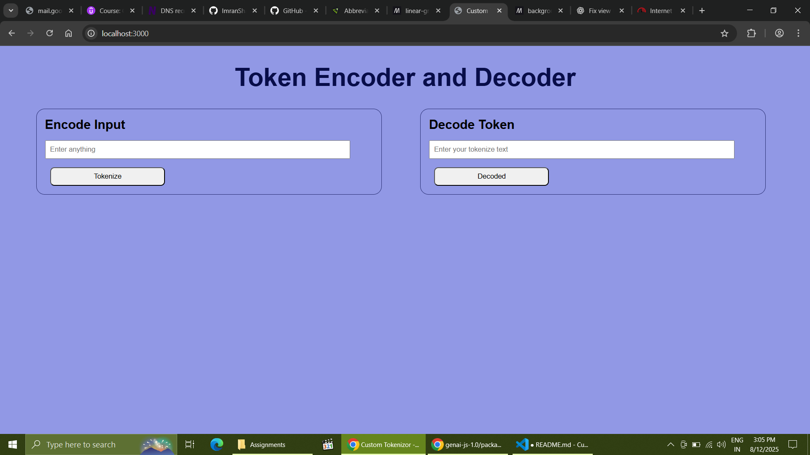
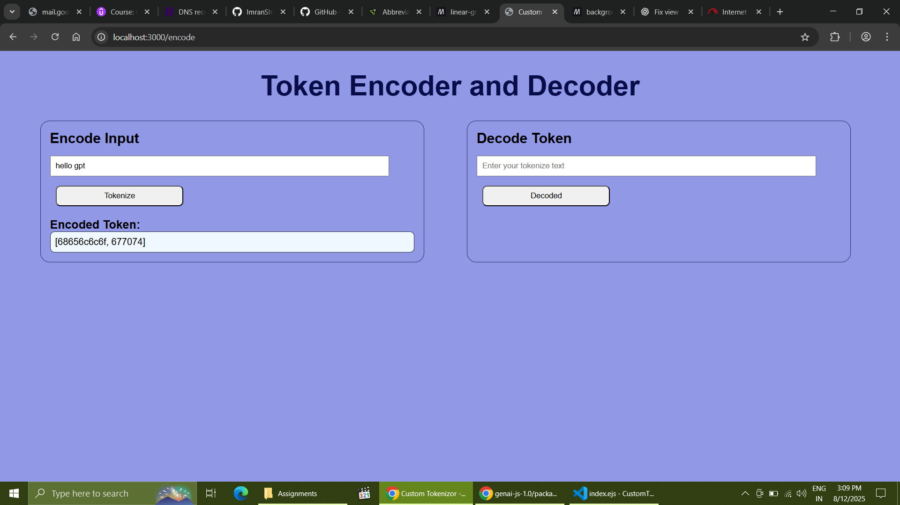
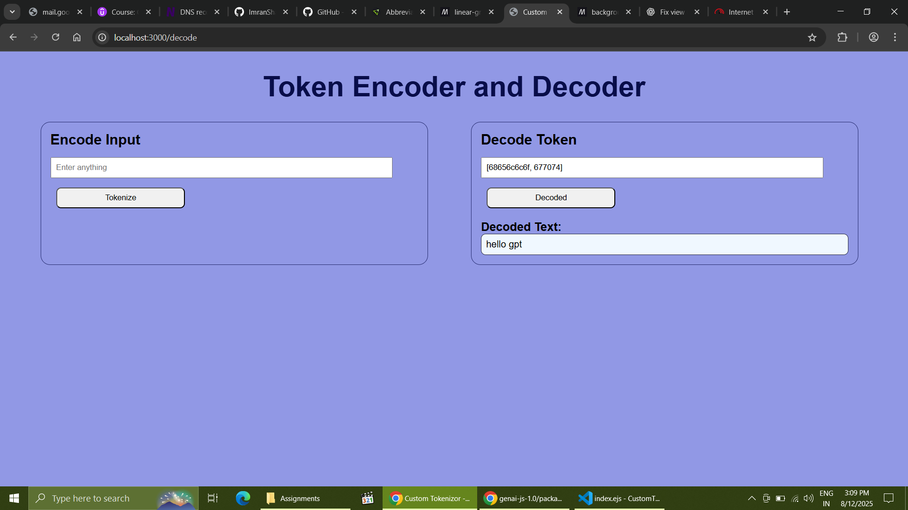

# 🔐 Custom Tokenizer (Encode & Decode)

This is a simple Node.js + Express web application that lets users:

- ✅ Encode plain text into hex tokens
- ✅ Decode hex tokens back into readable text

It's a great mini project to understand **text encoding**, **tokenization**,

---

## 🚀 Features

- Encode any sentence into an array of hex strings
- Decode the hex token array back to the original sentence
- Simple error handling for empty input
- Accepts token format like `[68656c6c6f, 677074]` and decodes it

---

## 📦 Tech Stack

- [Node.js](https://nodejs.org/)
- [Express](https://expressjs.com/)
- [EJS](https://ejs.co/) (for templating)
- HTML/CSS (basic styling)

---

## 🚀 How to Run This Project

### ✅ Step-by-Step Setup

1. **Install Node.js (if not already installed)**  
   Download from: [https://nodejs.org/](https://nodejs.org/)

2. **Clone this repository or download the folder**

   ```bash
   git clone <repository-url>
   cd CustomTokenizor
   npm install
   node app.js
   ```

## 📸 Screenshots

### 🔹 Home Page

Shows both encoding and decoding forms:



---

### 🔹 Encoding Example

Input text is encoded to hex tokens:



---

### 🔹 Decoding Example

Hex tokens are decoded back to readable text:


